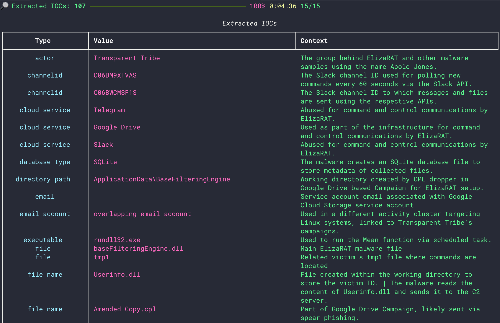

# **sensai** - AI-Aided Threat Intelligence & Hunting

sensai is a Python library and CLI application designed to assist threat hunters and intelligence analysts by automating the analysis of threat reports and facilitating the planning of threat-hunting activities.  

---

## **Features**

* Automated threat report analysis and IOC extraction with context.
* Flexible CLI benchmarking for various LLM models and inference parameters.
* Support for integrating with Langsmith for detailed inference tracing.
* **Web scraping support**: scrape threat reports directly from web pages.
* **Advanced document understanding**: Extract and analyze content from various formats including PDF, DOCX, PPTX, XLSX, Images, HTML, AsciiDoc, and Markdown via the [Docling library](https://github.com/DS4SD/docling).  

---

## **Showcase**



## **Requirements**

* Python >= 3.9 (3.11 recommended)
* All dependencies are listed in `requirements.txt`.  

---

## **Installation**

It is highly recommended to use a virtual environment like pipenv or pipx to ensure dependency isolation.

To install the package using pipx, run the following command:

```bash
pipx install --python 3.11 git+https://github.com/srozb/thsensai.git
```

⚠️ **Note:** The first execution might take longer due to compilation.

---

## **Ollama Setup**

### **1. Install Ollama**

Ensure Ollama is installed and updated. Follow the [official Ollama documentation](https://www.ollama.com/docs) for setup instructions.  

### **2. Pull a Model**

Download the required model, e.g., Qwen2.5:32b:  

```bash
ollama pull qwen2.5:32b
```

Pick a model supporting [function calling](https://ollama.com/search?c=tools) (tool).

### **3. Test Ollama**

Verify the setup by running a simple prompt:  

```bash
ollama run qwen2.5:32b "Why is the sky blue?"
```

### **4. Remote Ollama Usage**

To use Ollama on a remote machine, set the `OLLAMA_HOST` environment variable:  

```bash
export OLLAMA_HOST=192.168.192.1:11435
```  

Refer to Ollama documentation for advanced configuration.  

---

## **Usage**

### **Basic Usage**

* **Analyze a Report from a URL:**

  ```bash
  python sensai/cli.py analyze -c <optional css selector> -m qwen2.5:32b <report url>
  ```

  Where `-c` is an optional CSS selector to refine the scraping if needed, `-m` specifies the model to use, and `<report url>` is the URL of the report to analyze.

* **Analyze a Local Report File:**

  ```bash
  python sensai/cli.py analyze -m qwen2.5:32b report.pdf
  ```

  This example analyzes a local PDF file using the specified model.

### **Environment Variables**

To trace LLM inferences with Langsmith, configure the following environment variables:  

```bash
export LANGCHAIN_TRACING_V2=true
export LANGCHAIN_ENDPOINT="https://api.smith.langchain.com"
export LANGCHAIN_API_KEY="lsv2_pt_<api-key>"
export LANGCHAIN_PROJECT="sensAI"
```  

### **CLI Tool**

The CLI tool provides functionality to extract IOCs, benchmark models, and more. Run the following command to view the options:  

```bash
sensai --help
```  

### **Library Usage**

You can also use the `thsensai` library directly within your Python code for automated threat intelligence analysis:  

```python
from thsensai import hunter
```

This allows you to programmatically integrate threat hunting and intelligence analysis capabilities into your own projects.  

---

## **Benchmarks**

* Preliminary benchmark results are available in [docs/benchmark.md](docs/benchmark.md).  
* To run benchmarks, use the CLI:  

  ```bash
  sensai benchmark --help
  ```

* The benchmarking feature allows testing various models, chunk sizes, and inference parameters.  

---

## Disclaimer

**AI Output Verification:**

While the thsensai tool leverages advanced language models (LLMs) to assist in threat intelligence analysis and hunting, it is important to recognize that LLMs can occasionally produce incorrect or misleading information. The output generated by the tool should always be **verified by a human** analyst before being acted upon.

Threat hunting and intelligence analysis involve complex, high-stakes decisions, and the final judgment should always rely on expert human review. The tool is designed to assist in the process, but it does not replace the need for professional expertise and manual validation of all findings.

---

## **Known Limitations**

* **Scraping Strategy:** Current scraping requires defining valid CSS selectors to extract the correct data. Improvements are planned.
* **Model Testing:** Limited testing with models larger than 32b.  
* **Hypothesis Creation:** Automated generation of threat-hunting hypotheses is under development.  
* **OCR Integration:** OCR capabilities are planned.  

---

## **More Information**

* [AI-Assisted Threat Hunting - Unleashing the Power of Local LLMs - Part 1: Extracting IOCs with Context](https://www.linkedin.com/pulse/ai-assisted-threat-hunting-unleashing-power-local-llms-rozbicki-5kkkf/)
