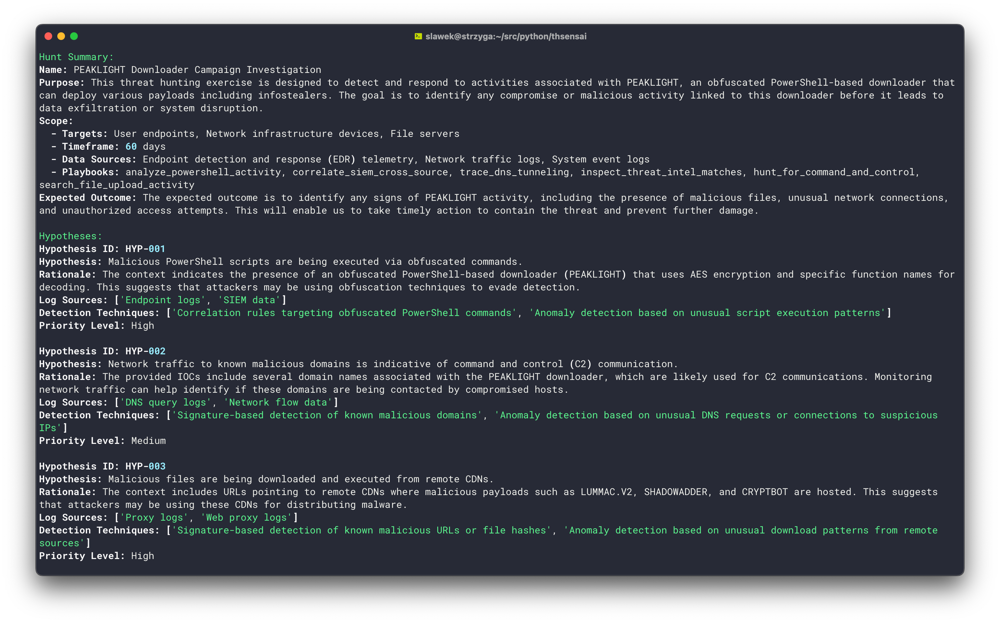

# **sensai** - AI-Aided Threat Intelligence & Hunting

sensai is a Python library and CLI application designed to assist threat hunters and intelligence analysts by automating the analysis of threat reports and facilitating the planning of threat-hunting activities.  

---

## **Features**

* Automated threat report analysis and IOC extraction with context.
* **Hunt plan generation**: Build the hunt plan according to the PEAK methodology, inferring the scope and suggesting playbooks for the hunt.
* **Web scraping support**: scrape threat reports directly from web pages.
* **Advanced document understanding**: Extract and analyze content from various formats including PDF, DOCX, PPTX, XLSX, Images, HTML, AsciiDoc, and Markdown via the [Docling library](https://github.com/DS4SD/docling).
* Flexible CLI benchmarking for various LLM models and inference parameters.
* Support for integrating with Langsmith for detailed inference tracing.

---

## **Showcase**

**IOC Extraction**


**Hunt plan**



## **Requirements**

* Python >= 3.10 (3.11 recommended)
* All dependencies are listed in `requirements.txt`.  

---

## **Installation**

It is highly recommended to use a virtual environment like pipenv or pipx to ensure dependency isolation.

To install the package using pipx, run the following command:

```bash
pipx install --python 3.11 git+https://github.com/srozb/thsensai.git
```

⚠️ **Note:** The first execution might take longer due to compilation.

---

## **Ollama Setup**

### **1. Install Ollama**

Ensure Ollama is installed and updated. Follow the [official Ollama documentation](https://www.ollama.com/docs) for setup instructions.  

### **2. Pull a Model**

Download the required model, e.g., Qwen2.5:32b:  

```bash
ollama pull qwen2.5:32b
```

Pick a model supporting [function calling](https://ollama.com/search?c=tools) (tool).

### **3. Test Ollama**

Verify the setup by running a simple prompt:  

```bash
ollama run qwen2.5:32b "Why is the sky blue?"
```

### **4. Remote Ollama Usage**

To use Ollama on a remote machine, set the `OLLAMA_HOST` environment variable:  

```bash
export OLLAMA_HOST=192.168.192.1:11435
```  

Refer to Ollama documentation for advanced configuration.  

---

## **Usage**

### **Basic Usage**

The `sensai` CLI tool provides three main commands: `analyze`, `benchmark`, and `hunt`.

#### **Analyze**

Analyze threat intelligence and extract Indicators of Compromise (IOCs).

```bash
python sensai/cli.py analyze [OPTIONS] SOURCE
```

**Options:**

* `-m, --model TEXT`: LLM model to be used for inference. [required]
* `-s, --chunk-size INTEGER`: Intel document split size. [default: 2600]
* `-o, --chunk-overlap INTEGER`: Intel document split overlap. [default: 300]
* `--num-predict INTEGER`: Maximum number of tokens to predict when generating text (-1 = infinite). [default: -1]
* `--num-ctx INTEGER`: Size of the context window used to generate the next token. [default: 4096]
* `-c, --css-selector TEXT`: Optional CSS selector value to limit the HTML parsing. [default: "body"]
* `-d, --output-dir TEXT`: Location of the report directory. [default: "./"]
* `-i, --write-iocs`: Create a report file. [default: False]
* `-n, --write-intel-docs`: Create a file with intelligence either scrapped or acquired from file. [default: False]
* `-y, --write-hypotheses`: Create a file with proposed hypotheses. [default: False]

**Examples:**

* Analyze a report from a URL:

```bash
python sensai/cli.py analyze -c "body" -m qwen2.5:32b https://example.com/report.html
```

* Analyze a local report file:

```bash
python sensai/cli.py analyze -m qwen2.5:32b report.pdf
```

#### **Benchmark**

Run benchmarks on multiple language models to evaluate performance.

```bash
python sensai/cli.py benchmark [OPTIONS]
```

**Options:**

* `-m, --models TEXT`: Comma-separated list of models in the format name:size (e.g., qwen2.5:32b,qwen2.5:14b). [required]
* `-s, --chunk-size TEXT`: Comma-separated list of chunk_size values (e.g., 2400,3200). [default: "2600"]
* `-o, --chunk-overlap TEXT`: Comma-separated list of chunk_overlap values (e.g., 150,300). [default: "200"]

**Examples:**

* Benchmark multiple models with various configurations:

```bash
python sensai/cli.py benchmark -m "qwen2.5:32b,qwen2.5:14b" -s "2400,3200" -o "150,300"
```

#### **Hunt**

Prepare the hunt plan template based on the given IoCs.

```bash
python sensai/cli.py hunt [OPTIONS] SOURCE
```

**Options:**

* `-m, --model TEXT`: LLM model to be used for inference. [required]
* `-s, --chunk-size INTEGER`: Intel document split size. [default: 3000]
* `-o, --chunk-overlap INTEGER`: Intel document split overlap. [default: 100]
* `--num-predict INTEGER`: Maximum number of tokens to predict when generating text (-1 = infinite). [default: -1]
* `--num-ctx INTEGER`: Size of the context window used to generate the next token. [default: 4096]
* `-d, --work-dir TEXT`: Location of the workspace directory. [default: "./"]
* `-c, --scopes TEXT`: Location of the workspace directory.
* `-p, --playbooks TEXT`: Location of the workspace directory.
* `-n, --num-hypotheses INTEGER`: Number of hypotheses to generate. [default: 5]
* `-a, --able`: Enrich hypotheses according to the ABLE methodology. [default: False]
* `-q, --quiet`: Suppress output. [default: False]
* `-w, --write-report`: Create a report file 'hunt.json'. [default: False]

**Examples:**

* Prepare a hunt plan from a local file:

```bash
python sensai/cli.py hunt -m qwen2.5:32b report.csv
```

### **Environment Variables**

To trace LLM inferences with Langsmith, configure the following environment variables:  

```bash
export LANGCHAIN_TRACING_V2=true
export LANGCHAIN_ENDPOINT="https://api.smith.langchain.com"
export LANGCHAIN_API_KEY="lsv2_pt_<api-key>"
export LANGCHAIN_PROJECT="sensAI"
```  

### **CLI Tool**

The CLI tool provides functionality to extract IOCs, benchmark models, and more. Run the following command to view the options:  

```bash
sensai --help
```  

### **Library Usage**

**WORK IN PROGRESS, API CHANGED** - not yet ready.

You can also use the `thsensai` library directly within your Python code for automated threat intelligence analysis:  

```python
from thsensai import hunter
```

This allows you to programmatically integrate threat hunting and intelligence analysis capabilities into your own projects.  

---

## **Benchmarks**

* Preliminary benchmark results are available in [docs/benchmark.md](docs/benchmark.md).  
* To run benchmarks, use the CLI:  

  ```bash
  sensai benchmark --help
  ```

* The benchmarking feature allows testing various models, chunk sizes, and inference parameters.  

---

## Disclaimer

**AI Output Verification:**

While the thsensai tool leverages advanced language models (LLMs) to assist in threat intelligence analysis and hunting, it is important to recognize that LLMs can occasionally produce incorrect or misleading information. The output generated by the tool should always be **verified by a human** analyst before being acted upon.

Threat hunting and intelligence analysis involve complex, high-stakes decisions, and the final judgment should always rely on expert human review. The tool is designed to assist in the process, but it does not replace the need for professional expertise and manual validation of all findings.

---

## **Known Limitations**

* **Scraping Strategy:** Current scraping requires defining valid CSS selectors to extract the correct data. Improvements are planned.
* **Model Testing:** Limited testing with models larger than 32b.  
* **Hypothesis Creation:** Automated generation of threat-hunting hypotheses is under development.  
* **OCR Integration:** OCR capabilities are planned.  

---

## **More Information**

* [AI-Assisted Threat Hunting - Unleashing the Power of Local LLMs - Part 1: Extracting IOCs with Context](https://www.linkedin.com/pulse/ai-assisted-threat-hunting-unleashing-power-local-llms-rozbicki-5kkkf/)
